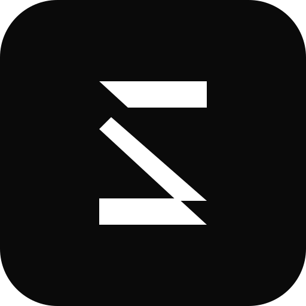

# Wildan Silki Sawabiqil Abroor — Official Engineering Portfolio & Knowledge Base

<p align="center">
  
</p>

<p align="center">
  <strong>Professional Software Engineer & Web3 Specialist</strong><br />
  High-Performance Full-Stack Systems • Smart Contracts • Quantitative Trading • Mobile Architectures
</p>

<p align="center">
  <a href="https://wildansilki.xyz"></a>
  <a href="https://github.com/silkiy"></a>
  <a href="https://www.linkedin.com/in/wildan-silki-69768a272/"></a>
  
  
  
  
</p>

---

## 🌐 Quick Language Navigation / Navigasi Cepat
- [🇬🇧 English Version](#-english-version)
  - [Overview](#overview)
  - [Key Architecture & Features](#key-architecture--features)
  - [SEO & Generative Engine Optimization (GEO)](#seo--generative-engine-optimization-geo)
  - [Technology Stack](#technology-stack)
  - [Project Directory Structure](#project-directory-structure)
  - [Getting Started & Local Development](#getting-started--local-development)
  - [Deployment & Production Verification](#deployment--production-verification)
- [🇮🇩 Versi Bahasa Indonesia](#-versi-bahasa-indonesia)
  - [Ringkasan Proyek](#ringkasan-proyek)
  - [Fitur Utama & Arsitektur Sistem](#fitur-utama--arsitektur-sistem)
  - [Fondasi SEO & Optimasi Mesin Pencari AI (GEO)](#fondasi-seo--optimasi-mesin-pencari-ai-geo)
  - [Teknologi yang Digunakan](#teknologi-yang-digunakan)
  - [Struktur Direktori Proyek](#struktur-direktori-proyek)
  - [Panduan Instalasi & Menjalankan Lokal](#panduan-instalasi--menjalankan-lokal)
  - [Kontak & Kolaborasi](#kontak--kolaborasi)

---

# 🇬🇧 English Version

## Overview
This repository houses the official portfolio, technical case studies repository, and engineering knowledge base for **Wildan Silki Sawabiqil Abroor** ([https://wildansilki.xyz](https://wildansilki.xyz)).

Architected with **Next.js 16 (Turbopack)**, **React 19**, **TypeScript**, and **Tailwind CSS v4**, this application is designed around an industrial terminal aesthetic. It delivers **100% pre-rendered Static Site Generation (SSG)** across 26 routes, sub-second TTFB, comprehensive JSON-LD Knowledge Graph schemas, and full **Generative Engine Optimization (GEO)** compatibility for AI agents and LLM scrapers.

---

## Key Architecture & Features

### 1. Dedicated Sub-Pages & URL Routing (`/[slug]`)
- **Projects Showcase (`/projects/[slug]`)**: In-depth software engineering case studies featuring architectural blueprints, technical challenges, solutions, and measurable business/technical outcomes:
  - `absensi-rsd`: Biometric face recognition attendance system (Flutter, TensorFlow Lite, Polygon Geofencing) for RSUD Mangusada Bali.
  - `token-vendor`: Decentralized autonomous token vending smart contract (Solidity, Ethereum, Hardhat).
  - `mit-profiling`: Enterprise talent directory and capability profiling platform (Node.js, Express, TypeScript, PostgreSQL) for PT Merkle Inovasi Teknologi.
  - `blayu-mobile`: Football academy curriculum management mobile application (Flutter, Firebase).
  - `simple-nft`: Gas-optimized ERC-721 smart contract suite with IPFS decentralized storage.
  - `maypi-platform`: Industrial utility water meter telemetry and analytics dashboard (React.js, Node.js).
  - `tani-cerdas`: Modern digital agriculture cooperative platform (Next.js, MongoDB).
- **Engineering Journal (`/blog` & `/blog/[slug]`)**: Technical essays complete with syntax-highlighted code implementations:
  - *Securing EVM Smart Contracts: Defending Against Reentrancy and State Pitfalls* (Solidity CEI pattern, ReentrancyGuard).
  - *Algorithmic Risk Management: The Math Behind Capital Preservation* (Expectancy formulas, Fractional Kelly, dynamic ATR stops, and Trinity v2 Pure Math Quant Engine in TypeScript).
  - *On-Device Biometric Verification in Flutter: High Accuracy at 60 FPS* (Dart Isolates producer-consumer pipeline).
  - *Hyper-Gemma AI Trader: Autonomous Bitget Futures Execution with Trinity v2 Quant Engine* (Pure Quant Tactical architecture, Quant Trinity Z-Score/Hurst/VWAP/Kalman Filter, passive Gemma 4 AI via Ollama).
  - *Quantitative Strategy Research on TradingView: Prototyping Trinity with Pine Script v5* (Pine Script v5 prototyping, statistical arbitrage backtesting, Hurst exponent fractal filter, and dynamic ATR stops).
- **Professional Experience & Research (`/experience/[slug]`)**:
  - Educational researcher at **Galeri Investasi BEI UISI** (Capital market telemetry and investment literacy).
  - Software engineer & research staff at **HMSI UISI (Ristek)** (IT trends, internal platform development).
  - Backend engineer at **Merkle Innovation (PT Merkle Inovasi Teknologi)** (RESTful APIs, PostgreSQL indexing).
- **Honors & Awards Dossier (`/achievements/[slug]`)**:
  - Virtual Trading Competition 2026 Participant — Indonesia Stock Exchange & Pasar Modal Indonesia (OJK, IDX, IDClear, KSEI).
  - 2nd Place International Game Development — Code Olympiad 2023.
  - Formal Provincial Recognition from the Acting Governor of East Java (Adhi Karyono).
  - Outstanding Graduate Award at SMK Telkom Malang.
  - Executive project presentation to Telkom Education Foundation leadership.
- **Custom Cyberpunk 404 Route (`/_not-found`)**: Dedicated terminal error boundary offering graceful error recovery with single-click navigation back to the primary matrix.

### 2. Comprehensive Data Streams & Credentials Archive (`#resume`)
- **Professional Summary**: Monospace engineering manifesto summarizing multi-disciplinary competencies across high-throughput distributed systems, Web3 protocols, and quantitative modeling.
- **Completed Internships**: Detailed role cards for Galeri Investasi BEI UISI, HMSI UISI (Ristek), and PT Merkle Inovasi Teknologi with direct subpage routing.
- **Competency Roles Grid**: 6 dedicated role profiles detailing architectural ownership:
  - *Full-Stack Developer*: End-to-end system design from reactive clients to cloud persistence layers.
  - *Front-End Developer*: Accessible, fluid user interfaces with micro-interactions and strict WCAG adherence.
  - *Backend Developer*: High-throughput RESTful services, database indexing, caching, and cryptographic verification.
  - *Blockchain Developer*: Trustless EVM smart contract engineering, gas optimization, and protocol security.
  - *Mobile Apps Developer*: High-performance native & Flutter mobile architectures with native OS bridge integrations.
  - *Quant Trader*: Algorithmic market models, statistical telemetry, position sizing, and automated risk systems.
- **Academic Foundation (`#education`)**: Verified education milestones:
  - *Universitas Internasional Semen Indonesia (UISI)* — Information Technology (2025 – Present).
  - *SMK Telkom Malang* — Software Engineering / RPL (2022 – 2025).
  - *SMPN 3 Tulungagung* — Junior High Education (2019 – 2022).
- **Accredited Licenses & Certifications (`#licenses`)**: 9 verified credentials:
  - *Blockchain Basics* — Cyfrin Updraft (Sep 2025).
  - *Learn OpenUSD: Model Kinds* — NVIDIA (Aug 2025).
  - *AI on Jetson Nano* — NVIDIA (Aug 2025).
  - *SKD (Sekolah Kedinasan)* — Badan Kepegawaian Negara / BKN (Aug 2025).
  - *DOT Competency* — PT DOT Indonesia (May 2025).
  - *UKK Fullstack Developer* — SMK Telkom Malang (Mar 2025).
  - *Rapid Developer* — Mendix (Dec 2024).
  - *Code Olympiad (2nd Place)* — Coding Bee Academy (Jan 2023).
  - *Junior Mobile Programmer* — Telkom Indonesia / BNSP (Certified).
- **Specialized Training, Workshops & Hackathons (`#activities`)**:
  - *Virtual Trading Competition 2026* — Indonesia Stock Exchange (IDX) & IDX Mobile (Sep 2026).
  - *Cyber Security Awareness* — Telkom Indonesia & Telkom Schools (Jun 2024).
  - *Indie Game Ignite* — COMPFEST 15 by Universitas Indonesia & Agate (Oct 2023).
  - *MANIAC XII Competition* — Universitas Surabaya / UBAYA (Aug 2023).
  - *Game Concept & Asset Design* — Workshop MANIAC XII UBAYA (Aug 2023).
  - *Modular Low-Code Design* — Merkle Academy & Mendix (Oct 2025).
- **Achievements & Honors Dossier (`#achievements`)**: 4 visual dossier cards featuring authentic event photography and credentials, detailed descriptions, and links to dedicated story pages.

### 3. Interactive Skills Matrix (`#skills`)
- **Categorized Multi-Technology Matrix**: 35+ technology stack competencies categorized with interactive filtering tabs:
  - `INDEX`: Complete global technology inventory.
  - `LANG`: Solidity, Rust, TypeScript, JavaScript, Golang, Kotlin, Dart, Java, Python, Julia, HTML5, CSS3.
  - `FRAMEWORKS`: Next.js, React, Node.js, Express, Flutter, TensorFlow.
  - `SYS_TOOLS`: Hardhat, PostgreSQL, MongoDB, MySQL, Supabase, Firebase, Docker, Git, Linux, Postman, Vercel, Odoo, OpenClaw.
  - `CREATIVE`: TradingView, Unity, Unreal Engine, Blender, After Effects, Twinmotion.
- **High-Fidelity Visuals**: Clean vector SVG icons and smooth Framer Motion stagger animations.

### 4. Interactive Terminal UI & Engineering Capabilities
- **Terminal Brutalism & Monospace Aesthetic**: Clean JetBrains Mono typography, custom grid matrices, sharp edges, and subtle glassmorphic surfaces.
- **Live GitHub Telemetry Engine (`#telemetry` & `/api/github-events`)**: Edge-cached endpoint fetching live public GitHub events, commit history, and activity timestamps directly from GitHub REST API for user `silkiy`, featuring live event categorization (PUSH, STAR, REPO, FORK, PR) and relative time calculation.
- **Multi-Language Resume Engine**: Interactive navbar dropdown enabling instantaneous direct cloud download of official Indonesian (`CV_Wildan_Silki_Bahasa_Indonesia.pdf`) and English (`CV_Wildan_Silki_English.pdf`) resumes hosted on Google Drive.
- **Multi-Channel Contact Terminal (`#contact`)**:
  - 1-click clipboard copy for official email (`contact.wildansilki@gmail.com`) and phone/WhatsApp (`+62 812-3252-2276`) with instant visual checkmark feedback.
  - Direct network link hubs (WhatsApp, GitHub, LinkedIn, Instagram).
  - Client-side validated contact form that programmatically generates and launches an end-to-end encrypted, structured WhatsApp message URL directly to Wildan Silki's WhatsApp.
- **Persistent Theme Engine**: Smooth, layout-shift-free switching between Dark, Light, and System modes powered by `next-themes`.
- **Intelligent Navigation & Scroll Handling**: Fixed header with backdrop blur, responsive mobile drawer menu, smooth anchor scrolling for home sections, and seamless cross-page navigation back to specific home sections from sub-pages.
- **Scroll-To-Top Engine**: Floating action button that automatically surfaces during long scrolls to facilitate frictionless return to the viewport apex.

---

## SEO & Generative Engine Optimization (GEO)

### Google Search Console & Schema Knowledge Graph
- **Entity Linking**: Interconnected JSON-LD graph tying **Wildan Silki Sawabiqil Abroor** (`Person`) to his official brand (`Brand`), website (`WebSite`), and primary portrait (`ProfilePage`).
- **Google Sitelinks**: `SiteNavigationElement` list registered in `<head>` for automated nested search results (Projects, Blog, Experience, Achievements, Resume, Contact).
- **Breadcrumbs**: Explicit `BreadcrumbList` on every sub-route to render clean URL trails (`wildansilki.xyz > Projects > Absensi RSD`).
- **Software Applications**: `SoftwareApplication` markup across all 7 projects with required `operatingSystem`, `offers` (free tier), and hero `image` references.
- **Automated Sitemap (`sitemap.xml`)**: Programmatically generated XML index covering all 26 static routes with priority rankings, update frequencies, and Google Image tags (`<image:loc>`).

### AI Agent & LLM Readability (`llmstxt.org`)
- **`/llms.txt`**: Standardized, compact markdown index providing immediate developer bio, skills matrix, and canonical markdown links for AI crawlers.
- **`/llms-full.txt`**: 15 KB unabridged plain-text knowledge base containing complete case study write-ups, source code snippets, journal essays, credential verification IDs, and explicit AI citation guidelines for models such as **ChatGPT, Claude, Perplexity, Gemini, DeepSeek, and Apple Intelligence**.
- **Modern AI Bot Crawler Policies (`robots.ts`)**: Explicitly configured `allow: "/"` for `OAI-SearchBot`, `GPTBot`, `ClaudeBot`, `anthropic-ai`, `PerplexityBot`, `Google-Extended`, `Applebot`, `CCBot`, `Diffbot`, `Bytespider`, and `Meta-ExternalAgent`.

---

## Technology Stack

| Layer | Technologies |
| :--- | :--- |
| **Framework & Core** | Next.js 16.3.4 (App Router, Turbopack, React Server Components), React 19, TypeScript |
| **Styling & Design** | Tailwind CSS v4, Lucide React, React Icons (FontAwesome, SimpleIcons, BoxIcons), JetBrains Mono |
| **Animation & UX** | Framer Motion, next-themes (Persistent Dark/Light Mode) |
| **API & Telemetry** | Next.js Route Handlers (`/api/github-events`), Web3Forms API |
| **Build & Quality** | ESLint 9 (Flat Config), Vitest, TypeScript strict mode |
| **Hosting & Edge** | Vercel Edge Network, HTTP/3, Automatic SSL |

---

## Project Directory Structure

```text
portfolio/
├── app/                              # Next.js App Router root
│   ├── achievements/[slug]/page.tsx  # Dynamic achievement detail routes
│   ├── api/github-events/route.ts    # GitHub telemetry API route handler
│   ├── blog/                         # Engineering journal index
│   │   └── [slug]/page.tsx           # Technical article detail pages
│   ├── experience/[slug]/page.tsx    # Work history and research detail pages
│   ├── projects/[slug]/page.tsx      # Comprehensive case study detail pages
│   ├── apple-icon.tsx                # Dynamic Apple Touch Icon (180x180)
│   ├── icon.tsx                      # Dynamic Favicon PNG (32x32)
│   ├── manifest.ts                   # Web App Manifest generator
│   ├── robots.ts                     # Search engine & AI bot robots configuration
│   ├── sitemap.ts                    # Dynamic XML sitemap with image metadata
│   ├── layout.tsx                    # Root layout, JSON-LD Schema & metadata
│   └── page.tsx                      # Main single-page portfolio view
├── components/                       # Modular React components
│   ├── Helper/                       # Reusable buttons, modals, scroll helpers
│   └── Home/                         # Hero, About, Projects, Skills, Footer, etc.
├── data/                             # Strongly-typed static content repositories
│   ├── achievementsData.ts           # Award details, dates, issuer metadata
│   ├── blogData.ts                   # Technical articles, headings, code snippets
│   ├── experienceData.ts             # Roles, organizations, responsibilities
│   └── projectsData.ts               # Case study architectures, problems, solutions
├── public/                           # Static assets served at root
│   ├── images/                       # Project screenshots and profile portraits
│   ├── logo/                         # Official SVG and PNG branding assets
│   ├── llms.txt                      # Compact AI agent index
│   └── llms-full.txt                 # Unabridged plaintext knowledge base
└── package.json                      # Project manifest and scripts
```

---

## Getting Started & Local Development

### Prerequisites
- Node.js 18.18.0 or later (Node.js 20+ recommended)
- npm, pnpm, or yarn

### Installation
1. Clone the repository:
   ```bash
   git clone https://github.com/silkiy/portfolio.git
   cd portfolio
   ```
2. Install dependencies:
   ```bash
   npm install
   ```
3. Configure Environment Variables:
   Create a `.env.local` file in the root directory:
   ```env
   # Web3Forms API Key for Contact Form Submissions
   NEXT_PUBLIC_WEB3FORMS_ACCESS_KEY="your-web3forms-access-key"

   # Optional Google Search Console Site Verification Token
   NEXT_PUBLIC_GOOGLE_SITE_VERIFICATION="your-verification-code"
   ```
4. Launch Development Server:
   ```bash
   npm run dev
   ```
   Open [http://localhost:3000](http://localhost:3000) in your browser.

---

## Deployment & Production Verification

Verify linting, type safety, and static build output before pushing:
```bash
# Run ESLint validation
npm run lint

# Run TypeScript type check
npx tsc --noEmit

# Compile production build (All 26 routes statically generated)
npm run build
```

---

<br />

# 🇮🇩 Versi Bahasa Indonesia

## Ringkasan Proyek
Repositori ini memuat kode sumber website portofolio resmi, arsip studi kasus proyek rekayasa perangkat lunak, dan pangkalan pengetahuan teknis dari **Wildan Silki Sawabiqil Abroor** ([https://wildansilki.xyz](https://wildansilki.xyz)).

Dibangun menggunakan **Next.js 16 (Turbopack)**, **React 19**, **TypeScript**, dan **Tailwind CSS v4**, aplikasi ini mengusung estetika antarmuka terminal industri modern. Seluruh halaman di-generate secara statis (**100% Static Site Generation - SSG**) mencakup 26 rute halaman, waktu muat sub-detik, struktur data terhubung Google Knowledge Graph, serta dukungan penuh **Generative Engine Optimization (GEO)** agar dapat dibaca dan dikutip secara akurat oleh sistem pencarian kecerdasan buatan (AI).

---

## Fitur Utama & Arsitektur Sistem

### 1. Sub-Halaman Studi Kasus & Rute Dinamis (`/[slug]`)
- **Studi Kasus Proyek Rekayasa (`/projects/[slug]`)**: Ulasan teknis mendalam mencakup diagram arsitektur, tantangan teknis, solusi rekayasa, dan hasil terukur:
  - `absensi-rsd`: Sistem absensi mobile dengan deteksi wajah on-device (TensorFlow Lite) dan verifikasi poligon geofencing koordinat GPS untuk RSUD Mangusada Bali.
  - `token-vendor`: Smart contract mesin penjual token terdesentralisasi otomatis di jaringan Ethereum (Solidity, Hardhat).
  - `mit-profiling`: Platform profil talenta korporat dan direktori keahlian internal berbasis Node.js, Express, dan PostgreSQL di PT Merkle Inovasi Teknologi.
  - `blayu-mobile`: Aplikasi mobile manajemen kurikulum akademik dan absensi siswa akademi sepak bola (Flutter, Firebase).
  - `simple-nft`: Smart contract ERC-721 hemat gas dengan penyimpanan metadata terdesentralisasi IPFS.
  - `maypi-platform`: Platform web pencatatan meter air digital dan analisis volume konsumsi utilitas (React.js, Node.js).
  - `tani-cerdas`: Platform manajemen data pertanian dan koperasi tani digital (Next.js, MongoDB).
- **Jurnal Rekayasa Teknis / Blog (`/blog` & `/blog/[slug]`)**: Artikel teknis mendalam lengkap dengan potongan kode:
  - *Securing EVM Smart Contracts: Defending Against Reentrancy and State Pitfalls* (Pola CEI Solidity & ReentrancyGuard).
  - *Algorithmic Risk Management: The Math Behind Capital Preservation* (Formula nilai harapan, Fractional Kelly, stop dinamis ATR, dan Pure Math Quant Engine Trinity v2 TypeScript).
  - *On-Device Biometric Verification in Flutter: High Accuracy at 60 FPS* (Pemrosesan pipeline Dart Isolates tanpa memblokir UI thread).
  - *Hyper-Gemma AI Trader: Autonomous Bitget Futures Execution with Trinity v2 Quant Engine* (Arsitektur Pure Quant Tactical, Quant Trinity Z-Score/Hurst/VWAP/Kalman Filter, dan mode pasif Gemma 4 AI via Ollama).
  - *Quantitative Strategy Research on TradingView: Prototyping Trinity with Pine Script v5* (Prototipe riset Pine Script v5, backtesting arbitrase statistik, filter fraktal eksponen Hurst, dan stop ATR dinamis).
- **Riwayat Pengalaman Kerja & Riset (`/experience/[slug]`)**:
  - Peneliti (Magang) di **Galeri Investasi BEI UISI** (Riset instrumen pasar modal dan literasi investasi edukatif).
  - Software Engineer & Staf Ristek di **HMSI UISI** (Eksplorasi tren teknologi dan arsitektur platform internal).
  - Backend Engineer (Magang) di **Merkle Innovation (PT Merkle Inovasi Teknologi)** (Optimalisasi kueri relasional dan API RESTful).
- **Rekam Jejak Prestasi & Penghargaan (`/achievements/[slug]`)**:
  - Peserta Virtual Trading Competition 2026 — Bursa Efek Indonesia & Pasar Modal Indonesia (OJK, IDX, IDClear, KSEI).
  - Juara 2 Internasional Game Development — Code Olympiad 2023 (Coding Bee Academy).
  - Penghargaan Pemerintah Provinsi Jawa Timur langsung oleh Pj. Gubernur Jawa Timur (Adhi Karyono).
  - Lulusan Berprestasi (Outstanding Graduate) SMK Telkom Malang Angkatan 2025.
  - Terpilih presentasi software langsung kepada Pimpinan Yayasan Pendidikan Telkom.
- **Rute Kustom 404 Cyberpunk (`/_not-found`)**: Penanganan rute tidak ditemukan dengan antarmuka terminal dan tombol kembali ke matriks utama.

### 2. Arsip Kredensial, Pengalaman & Rekam Jejak Akademik (`#resume`)
- **Ringkasan Profesional**: Manifesto teknis yang merangkum kompetensi lintas bidang mencakup arsitektur sistem terdistribusi, protokol Web3, dan pemodelan pasar kuantitatif.
- **Pengalaman Magang Selesai**: Kartu riwayat kerja terperinci untuk Galeri Investasi BEI UISI, HMSI UISI (Ristek), dan PT Merkle Inovasi Teknologi dengan tautan langsung ke sub-halaman.
- **Grid 6 Peran Kompetensi**: Pemetaan arsitektural dan tanggung jawab rekayasa:
  - *Full-Stack Developer*: Perancangan sistem menyeluruh dari antarmuka pengguna hingga lapisan persistensi data cloud.
  - *Front-End Developer*: Antarmuka pengguna responsif, ramah aksesibilitas (WCAG), dan berkinerja tinggi.
  - *Backend Developer*: Layanan API RESTful berkecepatan tinggi, optimasi indeks basis data relasional, dan verifikasi kriptografis.
  - *Blockchain Developer*: Rekayasa smart contract EVM aman, optimasi konsumsi gas, dan arsitektur dApp.
  - *Mobile Apps Developer*: Aplikasi mobile Flutter berkinerja tinggi dengan integrasi bridge native OS.
  - *Quant Trader*: Pengembangan sistem perdagangan algoritmik, telemetri statistik pasar modal, dan manajemen risiko presisi.
- **Fondasi Pendidikan Akademis (`#education`)**: Riwayat pendidikan formal terverifikasi:
  - *Universitas Internasional Semen Indonesia (UISI)* — S1 Teknologi Informasi (2025 – Sekarang).
  - *SMK Telkom Malang* — Rekayasa Perangkat Lunak / RPL (2022 – 2025).
  - *SMPN 3 Tulungagung* — Pendidikan Menengah Pertama (2019 – 2022).
- **Lisensi & Sertifikasi Terakreditasi (`#licenses`)**: 9 kredensial profesional resmi:
  - *Blockchain Basics* — Cyfrin Updraft (Sep 2025).
  - *Learn OpenUSD: Model Kinds* — NVIDIA (Agu 2025).
  - *AI on Jetson Nano* — NVIDIA (Agu 2025).
  - *SKD (Sekolah Kedinasan)* — Badan Kepegawaian Negara / BKN (Agu 2025).
  - *DOT Competency* — PT DOT Indonesia (Mei 2025).
  - *UKK Fullstack Developer* — SMK Telkom Malang (Mar 2025).
  - *Rapid Developer* — Mendix (Des 2024).
  - *Code Olympiad (Juara 2)* — Coding Bee Academy (Jan 2023).
  - *Junior Mobile Programmer* — Telkom Indonesia / BNSP (Tersertifikasi).
- **Pelatihan Khusus, Workshop & Hackathon (`#activities`)**:
  - *Virtual Trading Competition 2026* — Bursa Efek Indonesia (IDX) & IDX Mobile (Sep 2026).
  - *Cyber Security Awareness* — Telkom Indonesia & Telkom Schools (Jun 2024).
  - *Indie Game Ignite* — COMPFEST 15 oleh Universitas Indonesia & Agate (Okt 2023).
  - *MANIAC XII Competition* — Universitas Surabaya / UBAYA (Agu 2023).
  - *Game Concept & Asset Design* — Workshop MANIAC XII UBAYA (Agu 2023).
  - *Modular Low-Code Design* — Merkle Academy & Mendix (Okt 2025).
- **Dossier Prestasi & Penghargaan (`#achievements`)**: 4 kartu sorotan prestasi dengan foto dokumentasi asli dan tautan ulasan lengkap.

### 3. Matriks Keahlian Interaktif (`#skills`)
- **Inventaris Multi-Kategori**: 35+ teknologi terbagi dalam 5 kategori tab filter:
  - `INDEX`: Menampilkan seluruh teknologi yang dikuasai.
  - `LANG`: Solidity, Rust, TypeScript, JavaScript, Golang, Kotlin, Dart, Java, Python, Julia, HTML5, CSS3.
  - `FRAMEWORKS`: Next.js, React, Node.js, Express, Flutter, TensorFlow.
  - `SYS_TOOLS`: Hardhat, PostgreSQL, MongoDB, MySQL, Supabase, Firebase, Docker, Git, Linux, Postman, Vercel, Odoo, OpenClaw.
  - `CREATIVE`: TradingView, Unity, Unreal Engine, Blender, After Effects, Twinmotion.
- **Visual Vektor Berkualitas Tinggi**: Ikon SVG resmi dengan animasi transisi Framer Motion.

### 4. Antarmuka Terminal & Interaktivitas Pengguna
- **Estetika Terminal Cyberpunk**: Tipografi monospasi JetBrains Mono, grid garis halus, aksen brutalist industrial, dan permukaan glassmorphic.
- **Telemetri GitHub Real-Time (`#telemetry` & `/api/github-events`)**: Endpoint internal yang mengambil data commit dan aktivitas GitHub publik akun `silkiy` dengan filter (PUSH, STAR, REPO, FORK, PR) dan kalkulasi waktu relatif.
- **Pengunduhan CV Dua Bahasa**: Dropdown menu pada navbar untuk pengunduhan langsung berkas resume resmi versi Bahasa Indonesia dan Bahasa Inggris dari Google Drive.
- **Terminal Kontak Multi-Kanal (`#contact`)**:
  - Tombol 1-klik salin ke clipboard untuk email (`contact.wildansilki@gmail.com`) dan telepon/WhatsApp (`+62 812-3252-2276`) dengan umpan balik centang visual.
  - Tautan jejaring sosial (WhatsApp, GitHub, LinkedIn, Instagram).
  - Formulir kontak tervalidasi yang otomatis memformat dan meluncurkan tautan transmisi WhatsApp resmi terenkripsi langsung ke nomor Wildan Silki.
- **Mesin Tema Persisten**: Penggantian tema Gelap (Dark), Terang (Light), dan Sistem tanpa pergeseran tata letak menggunakan `next-themes`.
- **Navigasi Pintar & Penanganan Gulir**: Bilah navigasi tetap dengan efek blur, menu drawer mobile, scroll halus antar-seksi beranda, dan navigasi lintas halaman kembali ke beranda.
- **Tombol Kembali ke Atas (Scroll-To-Top)**: Tombol melayang otomatis saat halaman digulir ke bawah untuk kembali ke puncak halaman dengan satu klik.

---

## Fondasi SEO & Optimasi Mesin Pencari AI (GEO)

### Google Search Console & Schema Knowledge Graph
- **Validasi Entitas**: Grafik JSON-LD lengkap yang menghubungkan entitas **Wildan Silki Sawabiqil Abroor** (`Person`) dengan merek resmi (`Brand`), situs web (`WebSite`), dan foto potret utama (`ProfilePage`).
- **Google Sitelinks**: Skema `SiteNavigationElement` terdaftar pada elemen `<head>` untuk memicu tautan bertingkat di hasil pencarian Google.
- **Breadcrumbs**: Skema `BreadcrumbList` pada setiap sub-halaman agar URL pencarian rapi (`wildansilki.xyz > Projects > Absensi RSD`).
- **Aplikasi Perangkat Lunak**: Skema `SoftwareApplication` pada ke-7 proyek dengan atribut wajib `operatingSystem`, penawaran harga (`offers: Free`), dan thumbnail gambar resmi.
- **Peta Situs Otomatis (`sitemap.xml`)**: Menampung 26 rute statis lengkap dengan tag gambar `<image:loc>`.

### Keterbacaan Mesin AI (llmstxt.org)
- **`/llms.txt`**: Dokumen indeks ringkas standar Markdown untuk konsumsi cepat agen AI.
- **`/llms-full.txt`**: Dokumen teks lengkap berukuran ~15 KB berisi seluruh arsitektur proyek, kode sumber artikel teknis, riwayat pengalaman, ID lisensi kredensial, dan instruksi sitasi bagi model AI seperti **ChatGPT, Claude, Perplexity, Gemini, DeepSeek, dan Apple Intelligence**.
- **Perizinan Crawler AI (`robots.ts`)**: Izin penuh (`allow: "/"`) untuk `OAI-SearchBot`, `GPTBot`, `ClaudeBot`, `PerplexityBot`, `Google-Extended`, `CCBot`, `Diffbot`, dan `Bytespider`.

---

## Teknologi yang Digunakan

| Kategori | Teknologi |
| :--- | :--- |
| **Framework Utama** | Next.js 16.3.4 (App Router, Turbopack, SSG), React 19, TypeScript |
| **Desain & Tampilan** | Tailwind CSS v4, Lucide React, React Icons, JetBrains Mono |
| **Animasi & Tema** | Framer Motion, next-themes (Dukungan Dark/Light Mode persisten) |
| **API & Integrasi** | Route Handlers Next.js (`/api/github-events`), Web3Forms API |
| **Standar Kualitas Kode** | ESLint 9 (Flat Config), Vitest, TypeScript Strict Mode |
| **Infrastruktur Hosting** | Jaringan Edge Vercel, Protokol HTTP/3, SSL Otomatis |

---

## Panduan Instalasi & Menjalankan Lokal

1. Salin repositori:
   ```bash
   git clone https://github.com/silkiy/portfolio.git
   cd portfolio
   ```
2. Pasang dependensi paket:
   ```bash
   npm install
   ```
3. Siapkan berkas `.env.local`:
   ```env
   NEXT_PUBLIC_WEB3FORMS_ACCESS_KEY="kunci-akses-web3forms-anda"
   NEXT_PUBLIC_GOOGLE_SITE_VERIFICATION="kode-verifikasi-google-anda"
   ```
4. Jalankan server lokal:
   ```bash
   npm run dev
   ```
   Buka peramban di [http://localhost:3000](http://localhost:3000).

5. Uji build produksi:
   ```bash
   npm run build
   ```

---

## Kontak & Kolaborasi

Wildan Silki terbuka untuk proyek rekayasa perangkat lunak jarak jauh (*remote software engineering*), konsultasi teknis arsitektur Web3/Solidity, dan sistem perdagangan algoritmik kuantitatif.

- **Website Resmi:** [https://wildansilki.xyz](https://wildansilki.xyz)
- **Email:** [contact.wildansilki@gmail.com](mailto:contact.wildansilki@gmail.com)
- **WhatsApp:** [+62 812-3252-2276](https://wa.me/6281232522276)
- **GitHub:** [@silkiy](https://github.com/silkiy)
- **LinkedIn:** [Wildan Silki](https://www.linkedin.com/in/wildan-silki-69768a272/)
- **Instagram:** [@project_silki](https://www.instagram.com/project_silki)

---

<p align="center">
  Copyright &copy; 2026 <strong>Wildan Silki Sawabiqil Abroor</strong>. All rights reserved.
</p>
